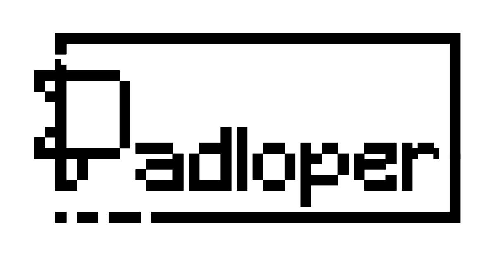
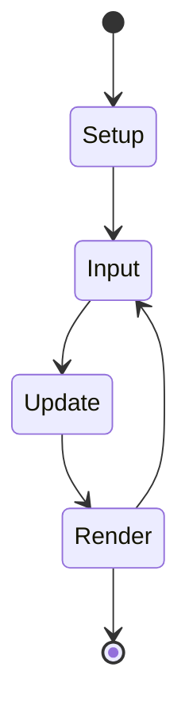

## TUTORIAL DE INSTALAÇÃO E USO

### Instalando as dependências do projeto:
> Pré-requisito: possuir Python 3 instalado, com seu gerenciador de pacotes, pip, funcionando.
* Instalar o TKinter, pela linha de comando ``` pip install tk ```
* Pronto. Já temos tudo necessário para executar o projeto. 

### Executando o projeto:
* Navegar até o projeto por um terminal 
* Executar o seguinte comando : ``` python3 ./ui/main.py ```
* Para construir um jogo com o atual mapa de jogo, clicar em BUILD.
* Para executar o jogo gerado, clicar em RUN.

### Criando seu próprio jogo:
* Para criar um jogo nesta versão do Padloper, é necessário editar o arquivo map.json
* Há modelos de jogos na própria pasta do projeto que contemplam todos os casos de uso da ferramenta. No entanto, é possível criar muitos estilos diferentes de jogos com aquelas poucas funcionalidades.  



# Padloper - Projetando uma game engine por subtração

  

Este repositório foi criado para o meu projeto de conclusão de curso pelo CEFET/RJ, no curso de Sistemas de Informação.

Conteúdo: 

1. [O que é o Padloper?](https://github.com/joaobuzato/padloper/blob/main/README.md#o-que-%C3%A9-o-padloper)
2. [Por que Game Engine por Subtração?](https://github.com/joaobuzato/padloper/blob/main/README.md#por-que-game-engine-por-subtra%C3%A7%C3%A3o-)
3. [Glossário](https://github.com/joaobuzato/padloper/blob/main/README.md#gloss%C3%A1rio)
4. [Como funciona um jogo no Padloper?](https://github.com/joaobuzato/padloper/blob/main/README.md#como-funciona-um-jogo-no-padloper)
5. [Como o Padloper é construído?](https://github.com/joaobuzato/padloper/blob/main/README.md#como-o-padloper-%C3%A9-constru%C3%ADdo)
	1. [Game Map (Mapa de Jogo)](https://github.com/joaobuzato/padloper/blob/main/README.md#game-map-mapa-de-jogo)
		1. [Screen](https://github.com/joaobuzato/padloper/blob/main/README.md#screen)
		2. [Scoreboard](https://github.com/joaobuzato/padloper/blob/main/README.md#scoreboard)
		3. [Actors](https://github.com/joaobuzato/padloper/blob/main/README.md#actors)
		4. [Rules](https://github.com/joaobuzato/padloper/blob/main/README.md#rules)
	3. [PadGame Builder (Construtor de um PadJogo](https://github.com/joaobuzato/padloper/blob/main/README.md#padgame-builder)
		1. [Screen Builder](https://github.com/joaobuzato/padloper/blob/main/README.md#screen-builder)
		2. [Actor Builder](https://github.com/joaobuzato/padloper/blob/main/README.md#actor-builder)
		3. [Manager Builder](https://github.com/joaobuzato/padloper/blob/main/README.md#manager-builder)
		4. [Scoreboard Builder](https://github.com/joaobuzato/padloper/blob/main/README.md#scoreboard-builder)
		5. [Rule Builder](https://github.com/joaobuzato/padloper/edit/blob/README.md#rule-builder)
		6. [Game Builder](https://github.com/joaobuzato/padloper/edit/blob/README.md#game-builder)


  

# O que é o Padloper?

Padloper é uma game engine construída como um framework, uma camada acima da biblioteca gráfica Turtle Graphics, para o Python. O objetivo final do projeto é possibilitar a um usuário sem qualquer conhecimento em programação a experiência de ser um game designer e desenvolver um jogo arcade simples, de apenas uma tela e poucos elementos, como o jogo [Frogger](https://en.wikipedia.org/wiki/Frogger). A ferramenta tem como principal meta ser uma opção viável para o primeiro contato de alguém com o desenvolvimento de jogos e game designing. 

O nome Padloper vem da menor tartaruga terrestre do mundo, cujo nome científico é *Homopus signatus*, e condiz com o escopo do projeto, que visa ser uma game engine pequena, enxuta e **diminuta**, e que usa os **Turtle Graphics** para atingir seus objetivos. 


> https://www.portaldosanimais.com.br/informacoes/caracteristicas-da-tartaruga-de-padloper-tamanho-e-nome-cientifico/
> 
# Por que "Game Engine Por Subtração" ?

O termo 'por subtração' surge de 'design por subtração', atribuído ao game designer Fumito Ueda, diretor dos jogos Ico e Shadow of The Colossus, e se refere à retirada de tudo que não for essencial à forma, tornando o produto final mais enxuto, simples e de escopo bem reduzido. 

Tal filosofia se encaixa perfeitamente na proposta do Padloper, que foi pensada com foco total no primeiro contato de alguém com a construção de jogos, e por isso muitas das funcionalidades mais "comuns" de game engines mais tradicionais são removidas - subtraídas - para que a linha de aprendizado seja a mais suave possível. 

Uma pergunta importante a se fazer para garantir que um elemento é passível de subtração é: "Caso um jogo não possua tal elemento, ele ainda é um jogo?". Em casos como a interação do usuário, a resposta é certamente não. Um jogo sem interação do usuário é uma outra coisa, mas não um jogo. Já em casos como o áudio, no entanto, a resposta pode ser sim. Um jogo sem som ainda é um jogo. E é aqui que a subtração age. 

  
# Glossário

* **Ator** : Elemento de jogo que possui componentes e comportamentos. Regras podem ser aplicadas a um ator e este poderá ser parte das consequências destas regras. <br/>
* **Tela** : Espaço onde o jogo é executado.<br/>
* **Ciclo de jogo**: Espaço de tempo no qual o jogo é executado. Pode-se dizer que uma 'volta' neste ciclo corresponde a um frame do jogo. Um ciclo de jogo possui os métodos Input, Update e Render, e também é dentro deste ciclo que as regras do jogo são checadas. <br/>
* **Classe-Gerente**: Em construção

Em construção

# Como funciona um jogo no Padloper?

Um jogo construído pelo padloper possui 4 componentes principais: Tela, Ciclo de Jogo, Atores e suas Classes-Gerentes. Durante a execução do ciclo de jogo, as classes-gerentes checam as regras e executam suas ações, eventualmente interagindo entre si, ou com a tela. 


> O ciclo de jogo compreende os métodos após o Setup (configuração inicial das classes-gerentes de jogo). 

Cada um destes métodos do ciclo de jogo possui um correspondente nas classes-gerentes dos atores. Isto permite que se chame cada um dos métodos próprios e que se personalize estes métodos dentro das classes-gerentes. 

```mermaid
sequenceDiagram
    Padmain.Update()->>+AtorGerente.Update(): Realize o método Update!
    AtorGerente.Update()->>+Ator: Atualize sua posição!
    Ator-->>-AtorGerente.Update(): Posição atualizada!
    AtorGerente.Update()-->>-Padmain.Update(): Ator Atualizado!

```
> No exemplo, o método Update, inserido dentro do Padmain, chama seu correspondente dentro da classe ator-gerente, que atualiza a posição do ator, e retorna o ator já atualizado, que será renderizado na próxima atualização de tela. 


# Como o Padloper é construído?

  

A ferramenta é construída em algumas partes, que compõem o todo do software. Abaixo estão descritas as ferramentas e suas funções:

  

## Game Map (Mapa de Jogo):

  

O mapa de jogo é um arquivo JSON que será o guia, ou a planta do jogo. O software está preparado para ler o arquivo e usar as informações nele contidas para construir o jogo.

Um mapa de jogo típico do Padloper é assim construído:
```
{
	"name" : "Padloper Game",
	"screen" : {},
	"scoreboard" : {},
	"rules" : [
		{}
	],
	"actors" : [
		{}
	]
}
```  

Cada um dos elementos do mapa possui em si uma série de outros elementos, e além do "name", que é o título do jogo, são eles:


### Screen 

O Objeto de Tela de um jogo executado com Turtle é o espaço no qual os objetos são desenhados, ou seja, é o espaço onde o jogo realmente acontece. Um elemento de tela num mapa de jogo construído pelo Padloper é como descrito abaixo:

```
"screen" : {
	"width" : 1000,
	"height" : 1000,
	"color" : "green"
}
```


*Elementos*:

Width: Largura da tela;<br/>
Height: Altura da tela;<br/>
Color: Cor do backgroud;<br/>

### Scoreboard

O Objeto de Scoreboard é um ator que faz o papel de placar.

Atualmente há alguns métodos pré-definidos para este ator que não são comandados pelo mapa, mas já estão imbutidos no framework para auxiliar na construção do jogo. São eles:

  

- point() : concede mais um ponto para o jogador e atualiza o placar na tela.<br/>

- game_over() : finaliza o ciclo de jogo e mostra a pontuação final no centro da tela, como condição de falha.<br/>

- game_won() : finaliza o ciclo de jogo e mostra a ponstuação final no centro da tela, como condição de sucesso. <br/>

  

Um elemento de Scoreboard no mapa de jogo Padloper é como disposto abaixo:

```
"scoreboard": {
	"position" : "top"
	"color" : "black"
	"font" : "Courier"
	"size" : "18"
}
```
*Elementos*:

Position: Posição do placar na tela;<br/>
Color: Cor das letras do placar;<br/>
Font: Fonte da escrita do placar;<br/>
Size: Tamanho da escrita do placar;<br/>

### Actors

  O array 'Actors' do jogo é uma lista dos atores que estarão presentes na execução do jogo, incluindo tanto atores que o jogador controla quanto os inimigos ou outros assets não controlados pelo jogador. 

Um ator é possui dentro de si alguns objetos, como descrito abaixo: 
```
{
      "name" : "player",
      "components" : {
	      "speed" : 8,
	      "size" : 2
      },
      "spawn" : 
      {
        "type" : "multiple",
	"max_num" : 300,
        "screen_update_count" : 12,
        "positions" : [
          {"x" :0, "y" : 470}
        ],
        "colors" : [
          "red"
        ]
      },
      "behaviors" :
        {
          "inputs" : [
            {"key" :  "w", "action" : "forward", "param" :  "10"},
            {"key" :  "s", "action" :  "backward", "param" :  "10"},
            {"key" :  "a", "action" :  "strife_left", "param" :  "10"},
            {"key" :  "d", "action" :  "strife_right", "param" :  "10"}
          ]
        },
        {
          "updates": [
            { "action" : "strife_left", "param" :  "10"}

          ]
      },
    }
```

*Elementos*:

Name: Nome do ator;

Components: Atributos estáticos do ator; <br/>
* Speed: Atributo de velocidade do ator na tela **( 1 - 10 )**;
* Size: Dimensão do ator. Como este parâmetro multiplica o tamanho do ator;

Spawn: Objeto com os parâmetros de geração do ator na tela;
* Type: Tipo de geração **( unique | multiple )**;
* Positions : Array de posições que o ator pode assumir ao ser gerado. Caso o tipo de geração seja **multiple**, o ator será gerado numa destas coordenadas, aleatoriamente.
	* x: Posição x onde o ator será gerado;
	* y: Posição y onde o ator seŕa gerado;
* Colors : Array de cores que o ator pode assumir ao ser gerado. Caso o tipo de geração seja **multiple**, o ator escolherá uma cor aleatoriamente.

Behaviors: Comportamentos que o ator pode possuir. Há dois tipos de ações que se encaixam dentro de "Behaviors": os inputs e os updates, e geralmente um mesmo ator não possui os dois simultaneamente. <br/>
* Inputs: lista de ações que o ator tomará ao pressionar de uma tecla. Um input possui:
	* Key: Tecla que, quando pressionada, executará a ação definida;
	* Action: Ação executada ao pressionar a tecla (O que o ator fará com este comando é definido pelo software);
	* Param: Parâmetro com o qual a ação será executada, que pode ser, por exemplo, o número de pixels que um ator andará, quantos graus ele se voltará, etc; 

* Updates: lista de ações que serão executadas pelo ator a cada novo frame, sem necessidade de uma interação do usuário.
	* Action: Ação executada ao pressionar a tecla (O que o ator fará com este comando é definido pelo software);
	* Param:  Parâmetro com o qual a ação será executada, que pode ser, por exemplo, o número de pixels que um ator andará, quantos graus ele se voltará, etc; 


### Rules
Esta lista contém os objetos que descrevem as regras do jogo. Regras são condições a serem atingidas e suas consequências, bem como o ator ou atores envolvidos nesta regra. Abaixo estão alguns exemplos de objeto de regras incluído no mapa de jogo: 

Exemplo de regra de colisão: 

```
{
	"trigger" : "collision",
	"actor1" : "player",
	"actor2" : "enemy",
	"consequences" : [
		{
		  "name" :"game_over"
		}
	]
}
```

_Elementos da Regra de **Colisão**_:

Trigger: Tipo de condição-gatilho para a regra ser ativada; **( collision | position | score)**<br/>
Actor1: Primeiro ator a ser checado; **(ator)**<br/>
Actor2: Segundo ator a ser checado; **(ator)**<br/>
Consequences: Lista de consequências a serem executadas assim que a condição-gatilho for atingida;<br/>
* Name: nome da consequência; **( game_over | point | move_to | game_won)**<br/>

> Importante: a condição-gatilho 'collision' checa apenas colisões entre dois tipos de atores, e não é possível checar colisão entre três tipos de atores nesta versão do Padloper. 

<br/><br/>


Exemplo de regra de posição: 

```
{
	"trigger" : "position",
	"x_pos" : "",
	"x_cond" : "",
	"y_pos" : "480",
	"y_cond" :"greater",
	"actor" : "player",
	"consequences" : [
		{
		  "name" : "point"
		},
		{
		  "name" : "move_to",
		  "y" : -480,
		  "x" : 0
	}
}
```
<br/><br/>


_Elementos da Regra de **Posição**_:

Trigger: Tipo de condição-gatilho para a regra ser ativada; **( collision | position | score)** <br/>
Actor: Ator cuja posição será checada; **(ator)** <br/>
X_pos: Posição no eixo X para que o a regra seja ativada; **( number | "" )**<br/>
X_cond: Condição relacionada ao eixo X para que a regra seja ativada; **( lesser | equal | greater )**<br/>
Y_pos: Posição no eixo Y para que o a regra seja ativada; **( number | "" )**<br/>
Y_cond: Condição relacionada ao eixo Y para que a regra seja ativada; **( lesser | equal | greater )**<br/>
Consequences: Lista de consequências a serem executadas assim que a condição-gatilho for atingida;<br/>
* Name: nome da consequência; **( game_over | point | move_to | game_won )**<br/>
	* Y: Posição do eixo Y para qual o Ator será movido **( number )**<br/>
	* X: Posição do eixo X para qual o Ator seŕa movido **( number )**<br/>

> Importante: a condição-gatilho 'position' poderá checar se um ator passou de uma coordenada na tela, no eixo x ou y caso apenas uma das coordenadas sejam informadas, ou se este ator atingiu um certo ponto da tela, caso as duas coordenadas sejam fornecidas.

<br/><br/>

Exemplo de regra de pontuação: 

```
{
	"trigger" : "score",
	"win_score" : 10
	"consequences" : [
		{
		  "name" :"game_won"
		}
	]
}
```

_Elementos da Regra de **Pontuação**_:

Trigger: Tipo de condição-gatilho para a regra ser ativada; **( collision | position | score)**<br/>
Win_Score: Pontuação a ser atingida para que a regra seja ativada. **( number > 0 )**<br/>
Consequences: Lista de consequências a serem executadas assim que a condição-gatilho for atingida;<br/>
* Name: nome da consequência; **( game_over | point | move_to | game_won )**<br/>


<br/><br/>


## Padgame Builder 

O Padloper Game Builder é o motor primordial da ferramenta. Esta peça do Padloper é o interpretador do mapa de jogo e o construtor do jogo de fato. 

Cada um dos elementos descritos do Mapa de Jogo possui um construtor próprio, e opera sob regras específicas para cada um dos objetos. 

Quais são as peças do Game Buider? 

### Screen Builder

Em construção

### Actor Builder

Em construção

### Manager Builder

Em construção

### Scoreboard Builder

Em construção

### Rule Builder 

Em construção

### Game Builder

Em construção


